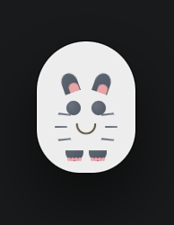
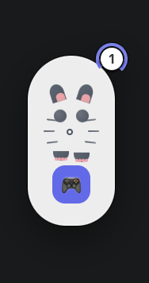
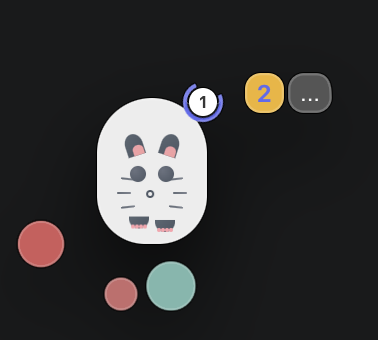

<p align="center">
  <a href="./README.md">中文</a> | <strong>English</strong>
</p>

---

# PetStareAI - Your AI Desktop Pet

What do you do to pass the time while your AI agent is working on a long task? A cute desktop pet that stays on your screen monitoring your AI coding tools. The cat is playful and might tease you sometimes 😺. Play a mini-game while waiting for your AI to finish working! The pet always stays on top, so you can see if your AI task has completed from any page.

<div align="center">
  
</div>

## 📸 Screenshots

| State | Screenshot | Description |
|-------|------------|-------------|
| **Idle** |  | Cat quietly watching your AI tools |
| **Running** |  | AI working, task count shown in corner |
| **In Game** |  | Play mini-game while waiting for AI to finish |

## ✨ Features

- 🐱 **Cute animated desktop pet** that stays on top of all windows
- 👀 **Monitors AI tools** (extensible plugin architecture):
  - ✅ Claude Code (VSCode extension)
  - ✅ Claude Code (terminal CLI)
  - ✅ OpenCode CLI
  - ✅ Qoder IDE
  - ✅ Qoder CLI
  - 🚧 OpenCode App - In progress
  - ⚙️ Cursor, Codex, ChatGPT, Gemini, Ollama and more - Planned
- 🎮 **Mini-game while waiting**: When AI is working, click popping colored balls to pass the time!
- 😺 **Different expressions for different states**:
  - Idle: Calm breathing
  - Running: Nervously waiting
  - Sleeping: Dozes off after long idle periods
- 🖱️ **Fully draggable** - move the cat anywhere on your desktop
- ✨ **Click-through transparent areas** - doesn't block clicks to apps below
- 🕒 **Auto-sleep** after 5 minutes of inactivity to stay out of the way
- 📱 **macOS native** - no dock icon, cat always visible on desktop

## 📥 Installation

### Download DMG

Download the DMG that matches your CPU architecture from [Releases](../../releases) or from the `dist/` (local build) folder:

- **Apple Silicon (M1/M2/M3)**: `dist/PetStareAI-1.0.0-arm64.dmg`
- **Intel**: `dist/PetStareAI-1.0.0.dmg`

### Installation Steps

1. Double-click to open the DMG
2. Drag **PetStareAI** to your Applications folder

### 🔧 Fix "File is Damaged" Error

Since the app is not signed, macOS will show "file is damaged" warning. Open **Terminal** and run this command:

```bash
sudo xattr -d com.apple.quarantine /Applications/PetStareAI.app
```

Enter your computer password, press Enter, and the app will open normally.

> 💡 Why does this happen?
> 
> This app is not signed and notarized with an Apple Developer account.
> macOS Gatekeeper blocks all unsigned third-party apps by default. This is a normal security
> mechanism, not actual file corruption. The command above simply tells macOS "I trust this app"
> and poses no security risk.

### Build from source

```bash
# Clone the repository
git clone https://github.com/dongfangyier/PetStareAI.git
cd PetStareAI

# Install dependencies
npm install

# Build React frontend
npm run build

# Package into DMG (macOS)
npm run package
```

## 🎮 Usage

1. Launch PetStareAI
2. The cat will appear centered on your screen
3. **Drag** the cat anywhere you like
4. **Right-click** → Quit to exit the app
5. While your AI is working (busy), a 🎮 button will appear - click to play the mini-game!

### Mini-game

When your AI is busy:
- Click the 🎮 button to start the game - window expands from compact 80×125 to full 180×180
- Colored balls pop up randomly at random intervals - click them to score points
- **+1 floating text** animation shows when you successfully click a ball
- **Cannot drag** the cat around **while playing the game**
- Use the menu button → Exit to close the game early
- Game automatically closes when AI finishes working

### Cat States

| State | Description | Expression |
|-------|-------------|------------|
| Idle | AI not running | Normal smile, slow breathing |
| Busy | AI working | Nervous small mouth |
| Success | Job completed | Big happy smile |
| Sleeping | Idle for 5+ minutes | Closed eyes, slow breathing |

## 📁 Project Structure

```
PetStareAI/
├── electron/
│   ├── main.js                 # Electron main process - process monitoring, window management
│   └── detectors/              # 🔌 Extensible detector plugin architecture
├── src/
│   ├── components/
│   │   ├── CatFace.jsx         # Animated cat face with state-based expressions
│   │   ├── CatFace.css
│   │   ├── ConfigPanel.jsx     # Configuration modal (placeholder for future)
│   │   ├── ConfigPanel.css
│   │   └── MiniGame.jsx        # Click-to-pop balls mini-game
│   │   └── MiniGame.css
│   ├── App.jsx                 # Main app component
│   ├── App.css
│   ├── main.jsx                # React entry point
│   └── index.css               # Global styles
├── assets/
│   ├── cat-icon.svg            # Project icon
│   ├── icon.icns               # App icon for macOS
│   └── icon.iconset/           # Icon files for packaging
├── dist/                       # Built DMG files
├── package.json                # Dependencies & build config
└── vite.config.js              # Vite configuration
```

## ⚙️ Development

```bash
# Start Vite dev server + Electron
npm run electron:dev

# Build only frontend
npm run build

# Package DMG
npm run electron:build
```

## 📝 TO DO

- [ ] Add custom cat themes/skins
- [ ] Add Lottie animations for smoother transitions
- [ ] More mini-games
- [ ] Activity tracking and statistics
- [ ] Configuration GUI window
- [ ] Windows/Linux support
- [ ] Support for other tools (Codex, Cursor, etc.)

## 📄 License

MIT
